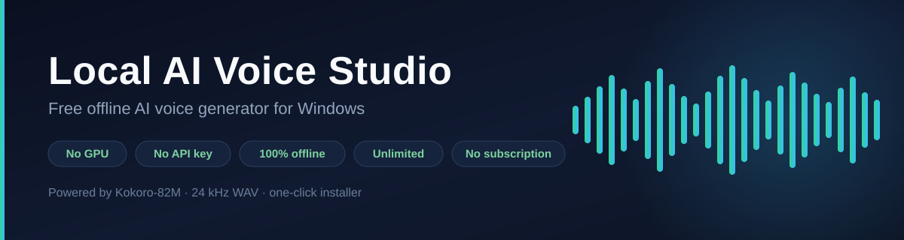

# Local AI Voice Studio

**A free offline AI voice generator for Windows.** Paste a script, click one button, get a broadcast-quality voiceover WAV file. No GPU, no API key, no account, no monthly fee, and no internet connection after the one-time setup.


-orange)


---

## Download

### ➡️ **[Download the one-click installer](https://github.com/harshvgaj-sudo/local-ai-voice-studio/releases/latest)**

One file. Double-click it. That is the whole install.

> **Windows will warn you.** The file is not code-signed (code signing costs money every year, and this project is free). Your browser may say *"This file isn't commonly downloaded"* and SmartScreen may say *"Windows protected your PC"*. Click **Keep** and **More info → Run anyway**. This is normal for any free, unsigned tool.

---

## How to use it

1. **Download** `Install Local AI Voice.bat` from the link above.
2. **Double-click it.** A black window appears and sets everything up by itself. This downloads about 1.5 GB and takes roughly 5–15 minutes depending on your internet speed. You do not need Python, and you do not need to install anything else.
3. **Wait for `READY TO RECORD`.** The studio window opens. Paste your script, pick a voice, press **GENERATE VOICE**. Your WAV file lands in the `output` folder next to the app.

After the first time, you never repeat the setup. Just double-click the **Local AI Voice Studio** desktop shortcut and the app opens in about a minute.

---

## Why this exists

Cloud AI voice services charge a subscription, cap your characters, and require you to upload your script to somebody else's server. Most local alternatives assume you are comfortable with a terminal, a GPU, and a stack of Python errors.

This project removes all of that:

- **One file to download.** No `pip install`, no `git clone`, no terminal, no virtual environment to activate by hand.
- **No GPU.** It runs on an ordinary laptop CPU. A graphics card is not detected, not needed, and deliberately not used.
- **No account, no key, no tracking.** The app makes no outbound connections once setup finishes. You can install it, turn off your Wi-Fi, and it still works.
- **Your script never leaves your computer.** It is processed locally, always.
- **Unlimited.** No character counter, no monthly quota, no watermark.

---

## What you get

| | |
|---|---|
| **Voices** | 9 hand-picked English voices — 3 US female, 2 US male, 2 UK female, 2 UK male |
| **Audio format** | 24 kHz mono WAV (16-bit PCM), ready to drop into CapCut, Premiere Pro, DaVinci Resolve or Audacity |
| **Speed control** | 0.7× to 1.4×, adjustable per generation |
| **Script length** | No hard limit. Long scripts are split into safe chunks and stitched back together automatically, with natural pauses at paragraph breaks |
| **Engine** | [Kokoro-82M](https://huggingface.co/hexgrad/Kokoro-82M) — 82M parameters, Apache-2.0 weights |
| **Interface** | A real application window, not a browser tab |

### The voices

| Voice | Accent | Character |
|---|---|---|
| `af_heart` | US Female | Warm documentary |
| `af_bella` | US Female | Expressive |
| `af_nicole` | US Female | Soft audiobook |
| `am_adam` | US Male | Deep commercial |
| `am_michael` | US Male | Podcast narrator |
| `bf_emma` | UK Female | Crisp newsreader |
| `bf_isabella` | UK Female | Calm and elegant |
| `bm_george` | UK Male | Classic British narrator |
| `bm_lewis` | UK Male | Deep, authoritative |

Kokoro-82M itself ships 54 voices across 8 languages. This app deliberately exposes only the 9 English ones, because a nine-item dropdown is usable and a fifty-four-item dropdown is not.

---

## System requirements

| | |
|---|---|
| **OS** | Windows 10 or Windows 11, 64-bit |
| **RAM** | 8 GB recommended (works on less, but generation slows down) |
| **Disk** | About 2 GB free |
| **GPU** | **Not required.** No NVIDIA, AMD or Intel graphics needed |
| **Python** | **Not required.** The setup installs its own private copy |
| **Internet** | Needed once, during setup. Never again |
| **Browser** | Microsoft Edge (already on every Windows PC) or Google Chrome, for the app window |

---

## What actually gets downloaded

The setup downloads roughly **1.5 GB** the first time and nothing after that.

| Component | Approx. size | What it is |
|---|---|---|
| Voice model (`kokoro-v1_0.pth`) | ~330 MB | The actual AI voice — downloaded once, yours forever |
| PyTorch (CPU build) | ~200 MB | The maths engine that runs the model |
| Gradio + web stack | ~150 MB | Draws the interface |
| Transformers, spaCy, misaki, numpy and friends | ~400 MB | Text processing — turns your words into sounds |
| Python 3.12 (private copy) | ~150 MB | Installed inside the app folder, never system-wide |
| `uv` + build tools | ~100 MB | The installer's own tooling |
| Language data (`en_core_web_sm`) | ~15 MB | Reads your text the way a narrator would |
| **Total** | **~1.5 GB** | |

Everything except the voice model lives inside one folder: `C:\Users\<you>\LocalVoiceStudio`. Nothing is installed system-wide, no registry keys are written, and no PATH entries are added.

The voice model goes into the standard Hugging Face cache at `C:\Users\<you>\.cache\huggingface\`. The bundled `Uninstall.bat` removes it for you.

---

## FAQ

**Does it really work without a GPU?**
Yes. It runs on CPU on purpose. On a mid-range laptop CPU expect roughly **1–3 minutes of generation per minute of finished audio**. A 1,000-word script (about 6–7 minutes of audio) takes a few minutes to render.

**Is it really free?**
Yes. The app is MIT licensed and the voice model is Apache-2.0. There is no paid tier, no account, and nothing to buy.

**Can I use the audio commercially — YouTube, client work, monetised videos?**
The model weights are released under Apache-2.0, which permits commercial use. Do check the licence yourself for your own situation; this is a description of the licence, not legal advice.

**Does my text get sent anywhere?**
No. The app makes no outbound requests while you use it. You can verify that by disconnecting from the internet and using it.

**Why does the first launch take about a minute?**
It loads a 330 MB neural network into memory. That is a real model doing real work, not a web page.

**How long a script can it handle?**
There is no built-in limit. Scripts are split at paragraph and sentence boundaries and rejoined with natural pauses, so a 5,000-word script works. It just takes longer and produces a bigger WAV.

**Which languages?**
English only — American and British. The nine voices cover those two accents.

**Why does Windows warn me when I run the installer?**
Because the file is unsigned. Signing certificates cost a few hundred dollars a year, which a free project does not have. The source is right here in this repository if you want to read exactly what it does before running it.

**How do I uninstall it?**
Run `Uninstall.bat` inside the app folder. It removes the engine and Python (about 2 GB) and offers to remove the voice model too. Your generated audio is kept.

---

## How it works

```
Install Local AI Voice.bat   (one file, self-contained)
        |
        |  decodes an embedded ZIP to %USERPROFILE%\LocalVoiceStudio
        v
START HERE.bat
        |
        |  1. downloads uv            (the installer's tooling)
        |  2. uv python install 3.12  (a private Python, inside the app folder)
        |  3. uv venv --seed          (an isolated environment)
        |  4. uv pip install -r requirements.txt
        |  5. spacy download en_core_web_sm
        |  6. _warmup.py              (fetches the 330 MB voice model)
        v
local_voice_app.py
        |
        |  Kokoro-82M on CPU  ->  24 kHz WAV
        v
   a real application window (Edge/Chrome in --app mode)
```

Two details worth knowing if you are reading the source:

- **The GPU is pinned off.** `KPipeline(device=None)` silently switches to CUDA when a compatible card is present. This app passes `device="cpu"` explicitly, so results are identical on every machine and nobody gets a surprise.
- **The window owns the studio's lifetime.** The app opens its own window and watches a private localhost debugging port that lives exactly as long as that window. Close the window and the studio shuts down — no invisible server left holding the port.

---

## Troubleshooting

| Problem | Fix |
|---|---|
| Setup stopped partway | Double-click `Repair Setup.bat` inside the app folder, or just run `START HERE.bat` again — it resumes where it left off |
| "Could not install the voice engine" | Almost always an interrupted download. Re-run `START HERE.bat` |
| The app window is blank | Close it and re-run `START HERE.bat`. The studio takes about a minute to start |
| Antivirus flagged something | PyTorch and the installer are large, unsigned downloads. Add the `LocalVoiceStudio` folder to your antivirus exclusions |
| Generation is very slow | Close other heavy programs. Check that the app says `Running on CPU only` and not an error |
| Everything is broken | Run `Uninstall.bat`, then the installer again. Your audio files are never touched |

---

## Credits and licence

- **Kokoro-82M** by [hexgrad](https://huggingface.co/hexgrad) — Apache-2.0. The voice quality is entirely their work.
- **StyleTTS 2** architecture by [@yl4579](https://github.com/yl4579).
- **misaki** and **kokoro** Python packages by hexgrad.
- **Gradio** for the interface layer.
- **uv** by [Astral](https://astral.sh) for the self-contained Python setup.

The application code in this repository is released under the **MIT licence** — see [LICENSE](LICENSE).

---

## Keywords

`free ai voice generator` · `offline text to speech` · `local tts` · `kokoro tts` · `ai voiceover` · `text to speech windows` · `no gpu tts` · `elevenlabs alternative free` · `ai voice generator without subscription` · `offline ai voice for youtube` · `python tts gui` · `kokoro 82m windows`

---

If this saved you a subscription, a ⭐ on the repository helps other people find it.
